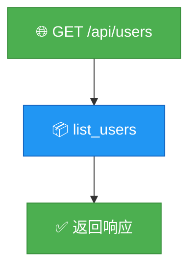

# API流程图

```mermaid
graph TD
    %% 样式定义
    classDef apiNode fill:#4CAF50,stroke:#388E3C,color:white
    classDef funcNode fill:#2196F3,stroke:#1565C0,color:white
    classDef dbNode fill:#FF9800,stroke:#EF6C00,color:white

    API_GET__api_users["🌐 GET /api/users"]:::apiNode
    API_GET__api_users_step0["📦 list_users"]:::funcNode
    API_GET__api_users --> API_GET__api_users_step0
    API_GET__api_users_end["✅ 返回响应"]:::apiNode
    API_GET__api_users_step0 --> API_GET__api_users_end


```

## 使用方法

1. 复制上面的Mermaid代码
2. 打开 [Mermaid Live Editor](https://mermaid.live)
3. 粘贴代码即可查看流程图

或者安装 VS Code 的 Mermaid 插件直接预览。
