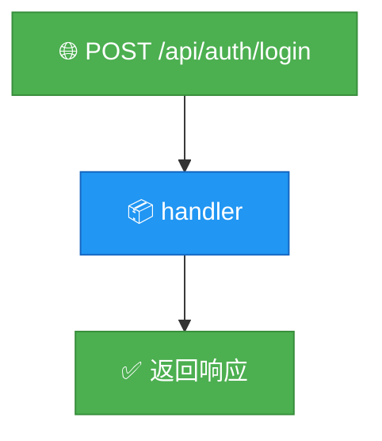

# POST /api/auth/login 流程图

```mermaid
graph TD
    %% 样式定义
    classDef apiNode fill:#4CAF50,stroke:#388E3C,color:white
    classDef funcNode fill:#2196F3,stroke:#1565C0,color:white
    classDef dbNode fill:#FF9800,stroke:#EF6C00,color:white

    API_POST__api_auth_login["🌐 POST /api/auth/login"]:::apiNode
    API_POST__api_auth_login_step0["📦 handler"]:::funcNode
    API_POST__api_auth_login --> API_POST__api_auth_login_step0
    API_POST__api_auth_login_end["✅ 返回响应"]:::apiNode
    API_POST__api_auth_login_step0 --> API_POST__api_auth_login_end


```
